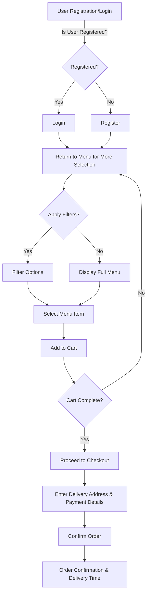

```mermaid
flowchart TD
A[User Registration/Login]
A --> |Is User Registered?| B{Registered?}
B --> |Yes| C[Login]
B --> |No| D[Register]
C --> E[Browse Menu]
D --> E[Browse Menu]

    E --> F{Apply Filters?}
    F --> |Yes| G[Filter Options]
    F --> |No| H[Display Full Menu]

    G --> I[Select Menu Item]
    H --> I[Select Menu Item]

    I --> J[Add to Cart]

    J --> K{Cart Complete?}
    K --> |Yes| L[Proceed to Checkout]
    K --> |No| E[Return to Menu for More Selection]

    L --> M[Enter Delivery Address & Payment Details]
    M --> N[Confirm Order]

    N --> O[Order Confirmation & Delivery Time]
```
